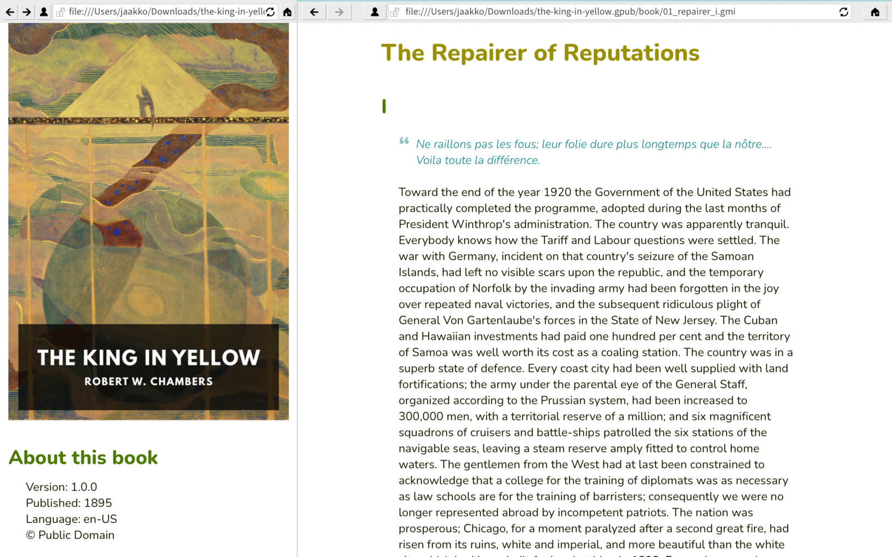

  

**[1 Overview](#1-overview)**  
&nbsp;&nbsp;&nbsp;&nbsp;&nbsp;[1.1 Rationale](#1-1-rationale)  
&nbsp;&nbsp;&nbsp;&nbsp;&nbsp;[1.2 Goals](#1-2-goals)  
&nbsp;&nbsp;&nbsp;&nbsp;&nbsp;[1.3 Non-Goals](#1-3-non-goals)  
**[2 Format](#2-format)**  
&nbsp;&nbsp;&nbsp;&nbsp;&nbsp;[2.1 File Extenstion and MIME](#2-1-file-extension-and-mime)  
&nbsp;&nbsp;&nbsp;&nbsp;&nbsp;[2.2 Directory Structure](#2-2-directory-structure)  
&nbsp;&nbsp;&nbsp;&nbsp;&nbsp;[2.3 Metadata](#2-3-metadata)  
&nbsp;&nbsp;&nbsp;&nbsp;&nbsp;[2.4 Content](#2-4-content)  
&nbsp;&nbsp;&nbsp;&nbsp;&nbsp;[2.5 Images](#2-5-images)  
**[3 Accessibility](#3-accessibility)**  
**[4 Recommendations](#4-recommendations)**  
&nbsp;&nbsp;&nbsp;&nbsp;&nbsp;[4.1 Charsets](#4-1-charsets)  
&nbsp;&nbsp;&nbsp;&nbsp;&nbsp;[4.2 External Links](#4-2-external-links)  
&nbsp;&nbsp;&nbsp;&nbsp;&nbsp;[4.3 Unfamilar File Formats](#4-3-unfamiliar-file-formats)  
**[5 Tools](#5-tools)**  


__Image: A Gempub book opened in Lagrange__

## 1 Overview

The application/gpub+zip media type ("gempub" or "GPUB") is a proposed new e-book file format that uses the ".gpub" file extension.

It is primarily intended to serve as a container for e-books containing text files of in the "text/gemini" format, allowing the author to avoid the complexity of using web technologies for e-books that do not require them. It has a secondary purpose of functioning as an archival format for Gemini capsules.

Questions, comments, help: oppen@fastmail.com

### 1.1 Rationale

While implementing an .epub reader, it became apparent that it is practically impossible to separate an ebook's data from its presentation. EPUB archives are zipped HTML, CSS, and metadata, and even Google with its infinite resources is unable to render pages correctly for all titles in Play Books, where mangled and unusable index pages are common. It's a lot of work and effort to attempt to convert HTML markup into another format that can be rendered natively.

### 1.2 Goals

Simplicity. Gempub follows the same original aims as the Gemini Protocol.

* It should be possible for somebody who had no part in designing the protocol to accurately hold the entire protocol spec in their head after reading a well-written description of it once or twice.
* A basic but usable (not ultra-spartan) client should fit comfortably within 50 or so lines of code in a modern high-level language. Certainly not more than 100. (In the case of gempub, the lines-of-code target may be ambitious but the spirit is the same.)
* A client comfortable for daily use which implements every single protocol feature should be a feasible weekend programming project for a single developer.


### 1.3 Non-Goals

There are lots of use-cases where Gempub isn't appropriate. For example, it is not intended for complex layouts or scientific notation. There are other formats that serve those use-cases better.

## 2 Format

### 2.1 File Extension and MIME

Gempub files end with the extension ".gpub" and their mime-type is `application/gpub+zip`

### 2.2 Directory Structure

Gempub files are `zip` archives that contain a Gempub index file (see "Gempub Index", below), a collection of `text/gemini` (`.gmi`) files, any supporting files such as images (see "Images", below), and an optional metadata file containing the title, author and any other optional fields (see "Metadata", below).

#### Example

```
// Example with index.gmi in a sub-directory, specified by the index value in metadata.txt

// .gpub contents:
book_title.gpub/
   metadata.txt
   cover.jpg
   book/
      index.gmi
      chapter1.gmi
      chapter2.gmi
      chapter3.gmi
      images/
         illustration.png

// metadata.txt:
title: book title
gpubVersion: 1.0.0
cover: cover.jpg
index: book/index.gmi
```
 
A Gempub container can be created by simply zip-compressing a capsule directory. This allows the Gempub container to serve as both an e-book container and as an offline Gemini capsule archive. In either case, however, the root of the zipped Gempub container must have either a Gempub index file named `index.gmi` or a metadata file named `metadata.txt` with an `index` value that points to the location of a valid Gempub index file. (See "Example", above.)
 
### 2.3 The `metadata.txt` Metadata File
 
The `metadata.txt` file enables Gempub to act as a full e-book format by allowing the author to specify data such as a title, a cover image, copyright information, a book description, and author information.

The metadata.txt file contains key-value pairs separated by line. Values start after the first colon and are trimmed (e.g., `author: Olaf Stapledon` and `author:Olaf Stapledon  ` are equivalent). All values are optional apart from `title` and `gpubVersion`. Order does not matter. If no index path is specified there must be an index.gmi in the directory root.

* `title` - a mandatory title of the work
* `gpubVersion` - mandatory Gempub format version: 1.0.0
* `index` - path to start index.gmi
* `author`
* `language` - BCP 47
* `charset` - Default is UTF-8, see below for other charsets
* `description`
* `published` - Format YYYY for when precise date is unknown
* `publishDate` - Format: YYYY-MM-DD eg. 1981-02-01
* `revisionDate` - Format: YYYY-MM-DD
* `copyright`
* `license`
* `version` - human readable only, not meant to be parsed
* `cover` - a JPG or PNG image which can be anywhere in the directory structure. For accessibility, and also because clipping may occur when maintaining the aspect ratio of the image, authors should NOT use text in the image.

This metadata is intended for readers to use to display a useful catalogue of multiple `.gpub` files and display covers for individual books. Metadata must never be used to specify flags for content rendering. Content should always be plain Gemtext. Reader applications must ignore custom parameters.

Example:
```
title: Star Maker
author: Olaf Stapledon
index: ./capsule/index.gmi
gpubVersion: 1.0.0
```

### 2.4 The Gempub Index File

The Gempub index file is a `text/gemini` compliant UTF-8 file that consists primarily (or solely) of a list of links to `text/gemini` content.

This file is a required file, and must either be located in the root directory of the archive and have the name `index.gmi`, or must have its name and location in the archive specified in the `index` entry of the `metadata.txt` file. 

If a reader application cannot find a valid Gempub index file in either the root of the archive or the location pointed to by the `index` entry of the `metadata.txt` file, the reader application must display an error indicating that the archive is not a valid Gempub archive. The reader application may then either (a) refuse to open the archive, or (b) display the contents of the `zip` archive's root directory and allow the user to choose a file to use as the Gempub index file.

When opening a Gempub archive, Gempub reader applications shall use the Gempub index page as the archive's table of contents, and shall display the archive's Gempub index page in accordance with the text/gemini specification. Gempub authors are expected to build the Gempub index page by adding links to content pages contained elsewhere within the archive. Remote links (links to remote resources that are not contained in the archive) are permitted within the Gempub index page, but reader applications must ignore remote links when creating an application-specific representation of the table of contents (see below) and when determining reading order (see below).

The Gempub index file may include content other than links. For example, the Gempub index file could include introductory text, or brief summaries of each chapter next to the link pointing to the chapter's content.

There are no other requirements with respect to the Gempub index file. Simple reader applications may display the page as the table of contents, with no additional work required, and archival Gempubs may use the "root" file of the capsule as-is.

More complex reader applications may use the Gempub index file to generate an application-specific representation of the archive's table of contents and to determine automatic reading order, as follows:

An application-specific representation of an archive's table of contents must be generated by assembling links to local resources (items contained within the Gempub archive itself) and displaying them in the order in which they are listed in the Gempub index file (from top to bottom). In other words, the first link in the application-specific representation of the table of contents must be the first local link in the Gempub index file.

If a link within the Gempub index file has a user-friendly link name, the Gempub reader application must display the user-friendly link name in the application-specific representation of the table of contents without prepending or appending any numbering or additional text. This permits Gempub authors to use their own chapter numbering and naming conventions. On the other hand, if a link within the Gempub index file has no user-friendly link name, the Gempub reader must display the link URL, and may prepend or append a number or other short descriptive text to the URL.

During the reading process, the user should be able to begin with the first item in the table of contents and seamlessly advance through the contents of the Gempub archive by instructing the reader application to display the next page. The Gempub reader application must automatically advance through the contents of the Gempub archive in the order in which links are listed in the Gempub index file. For example, in the case where a user has completed reading the text of the file pointed to by the first link in the Gempub index file, and the user then instructs the reader application to advance to the next page, the reader application must automatically load and display the beginning of the file pointed to by the second link in the Gempub index file. 
 
This automatic load-and-display behavior is only permitted with respect to local links that point to files contained within the Gempub archive. Per the `text/gemini` specification (section 5.4.2), clients must not automatically make any network connections as part of displaying [remote] links. Transparently loading a remote file in response to a user's "display next page" request would violate this prohibition. Therefore, in response to a "display next page" request by the user, Gempub reader applications must automatically skip over links to remote resources, and instead must load and display the contents of the next link in the Gempub index file that points to a local resource (i.e., a file contained within the Gempub archive).

The automatic load-and-display behavior must be performed only for top-level links that are directly listed in the Gempub index file. In other words, the reader application must not recursively descend through linked files to determine reading order. In the case of an e-book, for example, the first chapter displayed to the user must be the contents of the first link in the Gempub index file. When the user asks the reader to "display next page" at the end of the first chapter, the reader application must display the contents of the next link in the Gempub index fie.

### 2.5 Content

All text content must follow the `text/gemini` specification.

### 2.6 Images

The Gemini Protocol does not allow auto-loading of images for various reasons, none of which are applicable in an eBook. Gempub implementations can choose to handle images:

* Inline: any links that end in an image extension can be automatically inlined, retaining aspect-ratio based on available screen width.
* Linked: for implementation simplicity a clicked image link could take the user to a separate in-app image viewer (or even pass the link to the OS to display).

Supported formats are PNG and JPEG as they are common and included on most platforms.

Images must always include a description for accessibility:

```
//Invalid Gempub image syntax:
=> ./header.jpg

//Correct image syntax:
=> ./header.jpg A man floating through space
```

## 3 Accessibility

As well as including appropriate alt-text for images make sure screen readers are able to correctly interpret Gemtext. Gemtext has syntax for 3 different header types which may handled differently by screen readers. E.g., on Android, a text view may have the accessibility heading attribute `setAccessibilityHeading(boolean)`.

Images should never include text unless the text is repeated as text content immediately above or below the image.

## 4 Recommendations

### 4.1 Charsets

From the Gemini Protocol specification:

> If a MIME type begins with "text/" and no charset is explicitly given, the charset should be assumed to be UTF-8. Compliant clients MUST support UTF-8-encoded text/* responses. Clients MAY optionally support other encodings. Clients receiving a response in a charset they cannot decode SHOULD gracefully inform the user what happened instead of displaying garbage. 

Gempub readers should use a similar approach.

### 4.2 External Links

Readers should handle external links for both `https://` and `gemini://` by passing the URI to another application or the OS to render. Only local media files (i.e., files contained within the gempub archive) should be handled in the reader. The reader must not inline remote images. URLs are ephemeral, but linking to external capsules and websites would be useful for zines and articles. Novels or stories should obviously never do this.

### 4.3 Unfamiliar File Formats

Readers should expect to encounter unfamiliar file formats bundled in the `.gpub` file. Links to this content should be displayed, as the surrounding text might not make sense without the link text in place. Simple readers could just display a label with the filename and an 'unrecognised filetype:' prefix, whereas more advanced readers might pass the file to the OS to handle. The reader application must never omit the link text entirely if the filetype can't be handled.

## 5 Tools

* todo: write ePub to gPub converter
* todo: gPub validator (check image alt text, check all links are local/relative, check metadata)
* Capsule Scraper to gPub Archive: [cget](https://codeberg.org/oppenlab/cget) - in progress Gemini capsule scraper

